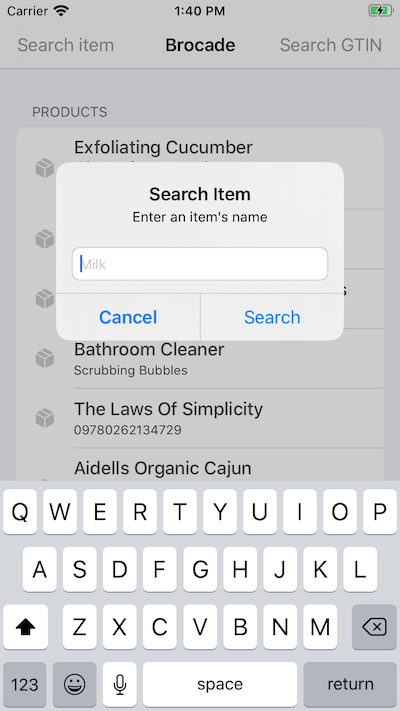

# 📦 Brocade
Swift library for the free and open product database.

[](https://travis-ci.org/imryan/Brocade)
[](https://cocoapods.org/pods/Brocade)
[](https://cocoapods.org/pods/Brocade)
[](https://cocoapods.org/pods/Brocade)

## Usage

```swift
// List last 100 items using delegate
let brocade = Brocade(delegate: self)
brocade.listItems()

// List last 100 items using closure
brocade.listItems { (items, error) in
    debugPrint("Items: \(items). Error: \(error?.localizedDescription).")
}

// Get item by code using delegate
let brocade = Brocade(delegate: self)
brocade.getItem(code: "00074887615305")

// Get item by code using closure
brocade.getItem(code: "00074887615305") { (item, error) in
    debugPrint("Item: \(item.itemSummary). Error: \(error?.localizedDescription).")
}

// Search item by query using delegate
let brocade = Brocade(delegate: self)
brocade.searchItem(query: "milk")

// Search item by query using closure
brocade.searchItem(query: "milk") { (items, error) in
    debugPrint("Items: \(items). Error: \(error?.localizedDescription).")
}
```

## Example

To run the example project, clone the repo, and run `pod install` from the Example directory first.



	
## Installation

Brocade is available through [CocoaPods](https://cocoapods.org). To install
it, simply add the following line to your Podfile:

```ruby
pod 'Brocade'
```

## Author

Ryan Cohen, notryancohen@gmail.com

## License

Brocade is available under the MIT license. See the LICENSE file for more info.
